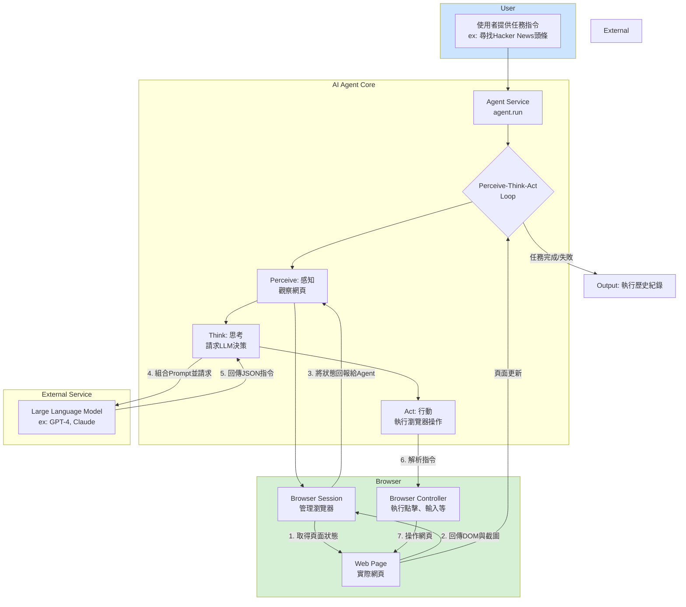

### 專案說明

這是一份根據您的提問，對 `browser-use-1118` 專案進行的詳細分析報告。

---

#### **1. 本專案用途是什麼? 核心功能是什麼? 實際應用場景是什麼?**

**專案用途與核心概念**

本專案是一個「AI 瀏覽器自動化框架」。您可以把它想像成一個能聽懂人類語言的智慧機器人，這個機器人的唯一任務就是操作網頁瀏覽器（例如 Chrome）。傳統上，要讓程式自動操作瀏覽器，需要編寫複雜的程式碼（例如 Selenium、Playwright），但透過本專案，您只需要用日常語言下達指令（例如：「幫我登入 Gmail」、「查詢今天台北的天氣」），AI 代理人（Agent）就會自主規劃步驟，並操作瀏覽器來完成任務。

對於大學生來說，您可以把它類比成一位虛擬實習生，您交代給他一個需要在網路上完成的任務，他會自己打開電腦、操作滑鼠鍵盤去完成，並把結果回報給您。

**核心功能：感知-思考-行動循環 (Perceive-Think-Act Cycle)**

專案的核心運作模式是一個不斷循環的過程：

1. **感知 (Perceive):** AI 代理人首先會「觀察」目前的網頁畫面。這包括擷取一張螢幕截圖，並分析頁面上有哪些可以互動的元素（如按鈕、輸入框、連結），為這些元素加上編號。
2. **思考 (Think):** 代理人將「觀察」到的畫面資訊，連同最初的任務目標，一起發送給一個大型語言模型（LLM，例如 GPT-4）。LLM 會像大腦一樣進行「思考」，判斷下一步應該執行什麼動作（例如：點擊第 15 號元素、在第 22 號輸入框中輸入文字）。
3. **行動 (Act):** 代理人接收到 LLM 的指令後，便會精確地在瀏覽器中執行這個動作。
4. **記錄與重複:** 完成一次行動後，代理人會記錄下剛剛的完整步驟（觀察了什麼、思考了什麼、執行了什麼），然後再次啟動新一輪的「感知-思考-行動」循環，直到最終任務完成為止。

**實際應用場景**

* **自動化重複性網路操作:**
  * **範例:** 自動登入多個網站簽到、定時抓取特定網站的資料（如股價、新聞）、自動填寫線上表單或問卷。
* **智慧資料搜集與整理:**
  * **範例:** 給定一個主題，代理人可以自動到 Google、維基百科等網站搜尋相關資訊，並將找到的資料整理成報告。例如：「幫我找出特斯拉最近三季的營收數字，並整理成表格」。
* **網站應用程式測試:**
  * **範例:** 軟體測試人員可以用自然語言描述測試流程（例如：「以使用者身份登入，前往購物車頁面，新增三個商品，然後檢查總金額是否正確」），讓代理人自動執行，取代傳統需要編寫大量程式碼的自動化測試。
* **個人數位助理:**
  * **範例:** 「幫我預訂下週五晚上從台北到高雄的高鐵票」、「登入我的電商帳號，查詢訂單『#12345』的最新運送狀態」。

---

#### **2. 本專案的 input/output 分別是什麼? 各自用途是什麼?**

**Input (輸入)**

專案的輸入主要有兩種類型：

1. **任務指令 (Task Instruction):**
    * **內容:** 一段描述任務目標的自然語言文字。
    * **用途:** 這是整個專案最核心的輸入，它告訴 AI 代理人「要做什麼」。
    * **範例:** `"Find the top post on Hacker News and summarize its comments."` (找出 Hacker News 上的熱門文章並總結其評論)。

2. **環境配置 (Configuration):**
    * **內容:** 包含 API 金鑰、模型名稱、執行模式等設定的檔案。專案主要透過 `.env` 檔案和 `config.json` (或環境變數) 進行配置。
    * **用途:** 這些配置告訴代理人「如何工作」。
    * **範例:**
        * `OPENAI_API_KEY="sk-..."`: 在 `.env` 檔案中設定，用於驗證 OpenAI 服務的身份。
        * `"headless": true`: 在 `config.json` 中設定，讓瀏覽器在背景執行，不會跳出實際的視窗。
        * `"max_steps": 25`: 設定代理人最多執行 25 個步驟，以防陷入無限循環或產生過高費用。

**Output (輸出)**

專案的最終產出是一個紀錄了完整執行過程的「歷史紀錄 (History)」。

* **內容:** 這是一個結構化的資料物件，詳細記錄了代理人在執行任務時的每一步，包含：
  * 該步驟開始時的**網頁狀態** (DOM 結構、螢幕截圖)。
  * LLM 的**思考過程** (Thought)。
  * LLM 決定的**具體行動** (Action)，例如 `CLICK`、`TYPE`、`DONE`。
  * 行動的**結果** (成功或失敗)。
  * 如果任務完成，最終的**答案** (Answer) 也會包含在內。
* **用途:**
  * **偵錯與分析:** 當代理人執行失敗或行為不符合預期時，可以透過查閱歷史紀錄來了解它在哪一步「想錯了」或「做錯了」。
  * **結果驗證:** 歷史紀錄提供了任務完成的完整證據鏈，包括最終的答案和達成該答案的過程。
  * **可視化重現:** 由於每一步都有螢幕截圖，可以將整個過程串連起來，像播放影片一樣重現代理人的操作。
* **範例:** 如果任務是「查詢蘋果公司目前的股價」，最終輸出的歷史紀錄中，最後一個步驟可能看起來像這樣 (簡化後)：
    ```json
    {
      "step": 10,
      "observation": "Page shows 'AAPL: $175.20'.",
      "thought": "I have found the stock price for Apple Inc. The task is complete.",
      "action": "DONE",
      "action_input": null,
      "answer": "The current stock price for Apple (AAPL) is $175.20."
    }
    ```

---

#### **3. 本專案用到那些 LLM ? 分別使用在哪裡? LLM 產生什麽結果?**

**使用的 LLM**

本專案在設計上是「模型中立 (Model-Agnostic)」的，代表它不限定只能使用某一種 LLM。透過 `browser_use/llm/` 目錄下的模組化設計，它可以支援市面上多種主流的 LLM 供應商，包括：

* **OpenAI** (e.g., `gpt-4-turbo`, `gpt-3.5-turbo`)
* **Anthropic** (e.g., `claude-3-opus-20240229`, `claude-3-sonnet-20240229`)
* **Google** (e.g., `gemini-1.5-pro-latest`)
* **Groq**, **Ollama** (可用於執行本地模型) 等。

使用者可以透過修改設定檔中的 `llm_model_name` 參數來自由切換。

**LLM 的使用位置**

LLM 在專案中扮演著**代理人的「大腦」**，它被使用在「**思考 (Think)**」這個環節。

具體來說，在 `browser_use/agent/service.py` 檔案的 `Agent.step()` 方法中，代理人會將當前的「觀察」(簡化後的網頁 DOM 結構、截圖) 和「任務目標」打包成一個結構化的提示 (Prompt)，然後呼叫 LLM。

**LLM 產生的結果**

LLM 的任務不是生成一段普通的對話，而是必須回傳一個**嚴格的 JSON 格式**的指令。這個 JSON 物件是代理人下一步行動的唯一依據。

* **結果格式範例:**
    ```json
    {
      "thought": "The user wants to log in. I see a username field, a password field, and a login button. I will first type the username, then the password, and finally click the login button.",
      "action": "TYPE",
      "action_input": {
        "element_id": 15,
        "text": "testuser@example.com"
      }
    }
    ```
* **結果說明:**
  * `thought`: LLM 的內心獨白，解釋它為什麼要這麼做。這對於除錯非常有幫助。
  * `action`: 一個從預設動作清單中選擇的指令，例如 `TYPE` (打字)、`CLICK` (點擊)、`SCROLL` (滾動頁面)、`DONE` (任務完成)。
  * `action_input`: 執行該動作所需要的參數。例如，`TYPE` 動作需要知道在哪個元素 (`element_id`) 輸入以及要輸入的文字 (`text`)。

總結來說，LLM 在此專案中的角色是**決策者**，它將非結構化的網頁資訊和人類語言目標，轉化為結構化的、可執行的機器指令。

---

#### **4. 調整配置參數會有哪些影響?**

配置參數讓使用者可以微調 AI 代理人的行為、成本和效能。以下是幾個關鍵參數的詳細說明 (主要來自 `.env.example` 和 `browser_use/config.py`)：

* **`TASK`**
  * **說明:** 要執行的自然語言任務。
  * **影響:** 這是最重要的參數，直接決定了代理人的目標。改變這個值會讓代理人執行完全不同的任務。

* **`LLM_MODEL_NAME`**
  * **說明:** 指定要使用的 LLM 模型，例如 `"gpt-4-turbo"` 或 `"claude-3-opus-20240229"`。
  * **影響:**
    * **智慧與效能:** 更強大的模型（如 GPT-4, Claude Opus）通常能理解更複雜的指令，處理更棘手的網頁，但成本也更高，回應速度可能較慢。
    * **成本:** 不同模型的價格差異很大。
    * **穩定性:** 某些模型在遵循 JSON 格式指令方面可能比其他模型更穩定。

* **`HEADLESS`**
  * **說明:** 設定為 `true` 或 `false`。
  * **影響:**
    * `true` (預設): 瀏覽器會在背景執行，沒有圖形介面。這樣可以節省系統資源，適合在伺服器上自動化執行。
    * `false`: 會實際打開一個 Chrome 瀏覽器視窗，您可以即時觀看代理人的每一步操作。這對於開發和偵錯非常有幫助。

* **`MAX_STEPS`**
  * **說明:** 代理人執行任務的最大步驟數，是一個整數。
  * **影響:** 這是一個安全機制，用來防止代理人陷入無限迴圈或在一個簡單任務上花費過多步驟（和費用）。如果任務在達到此步數前未完成，代理人將強制停止。

* **`API_KEY` 相關參數 (e.g., `OPENAI_API_KEY`, `ANTHROPIC_API_KEY`)**
  * **說明:** 各個 LLM 服務提供商的 API 金鑰。
  * **影響:** 這是使用對應 LLM 服務的憑證。如果未設定或設定錯誤，代理人將無法呼叫 LLM 進行「思考」，從而無法運作。

* **`RECORD_VIDEO`**
  * **說明:** 設定為 `true` 或 `false`。
  * **影響:** 如果設定為 `true`，專案會將代理人操作的全程錄製成一個影片檔案。這對於展示、報告或非技術人員理解代理人行為非常有用。

---

#### **5. 請提供完整執行過程步驟與系統架構。**

**完整執行過程步驟 (以 `examples/simple.py` 為例)**

1. **初始化:**
    * 程式啟動，首先從 `.env` 檔案和 `config.json` (或環境變數) 載入所有配置參數。
    * 根據配置，建立 `Agent` 物件的實例。

2. **啟動執行:**
    * 呼叫 `agent.run()` 方法，並傳入任務指令 (例如: `"Find the top story on Hacker News"`)。

3. **進入「感知-思考-行動」循環:**
    * **第 1 步 (Perceive):**
        * `Agent` 啟動一個由 `BrowserSession` 管理的 Chrome 瀏覽器。
        * 導航到初始頁面 (例如 `https://news.ycombinator.com`)。
        * `BrowserSession` 呼叫 `get_browser_state_summary()` 方法，分析網頁 DOM，找出所有可互動元素 (連結、按鈕、輸入框)，並為它們標上數字 ID。同時擷取一張當前頁面的螢幕截圖。
    * **第 2 步 (Think):**
        * `Agent` 將任務目標、到目前為止的歷史紀錄、以及剛剛「感知」到的頁面狀態，組合成一個詳細的 Prompt。
        * `Agent` 呼叫指定的 LLM (例如 GPT-4)，並將此 Prompt 發送過去。
        * LLM 分析後，回傳一個包含 `thought` 和 `action` 的 JSON 物件。例如: `{"thought": "I see a list of stories. The first one seems to be the top one. I will click it.", "action": "CLICK", "action_input": {"element_id": 12}}`。
    * **第 3 步 (Act):**
        * `Agent` 解析 LLM 回傳的 JSON，得到指令 `CLICK` 和目標 `element_id: 12`。
        * `Agent` 透過瀏覽器控制器，在網頁上執行點擊第 12 號元素的動作。
    * **第 4 步 (Record & Repeat):**
        * `Agent` 記錄下這完整的一步。
        * 瀏覽器頁面發生了變化，`Agent` 重新開始新一輪的「感知-思考-行動」循環，直到 LLM 回傳 `DONE` 動作或達到 `MAX_STEPS` 上限。

4. **結束:**
    * `agent.run()` 方法執行完畢，回傳包含所有步驟的完整歷史紀錄。

**系統架構 (Mermaid 格式)**



---

#### **6. 本專案在公司內部有哪些應用方向 ?**

基於本專案的核心能力，它在公司內部有多種極具價值的應用方向：

1. **自動化內部系統操作與報表生成:**
    * **場景:** 許多公司依賴沒有 API 的內部儀表板（Dashboard）或舊式系統來查詢業務數據。
    * **應用:** 可以部署一個代理人，定時（例如每天早上 8 點）自動登入這些系統，導航到指定的報表頁面，篩選日期，下載 Excel 或 CSV 報表，然後將檔案上傳到共用雲端硬碟或透過 Email 發送給相關團隊。這將取代原本需要人工執行的重複性工作。

2. **智慧化品質保證 (QA) 測試:**
    * **場景:** 網站或內部應用的前端功能需要頻繁進行回歸測試，以確保新的程式碼不會破壞現有功能。傳統的自動化測試腳本（如 Selenium）編寫和維護成本高。
    * **應用:** QA 團隊可以用自然語言編寫測試案例，例如：「以 admin 帳號登入後台，進入使用者管理頁面，新增一位名為『Test User』的使用者，然後驗證該使用者是否出現在列表中，最後將其刪除。」代理人可以將這些語言轉化為實際操作，大幅降低測試自動化的門檻。

3. **競爭情報與市場數據監控:**
    * **場景:** 需要定期監控競爭對手的網站，以了解其產品、定價、行銷活動的變化。
    * **應用:** 設定一個代理人，每天自動訪問數個競爭對手的網站，抓取其定價頁面的資訊，或檢查是否有新的部落格文章或新聞稿發布。如果發現變化，可以自動截圖並發送通知給產品或市場團隊。

4. **新進員工帳號自動開通:**
    * **場景:** 新員工入職時，HR 或 IT 人員需要在多個不同的內部系統（如 HR 系統、郵件系統、專案管理工具）中手動為其建立帳號。
    * **應用:** 建立一個「新員工入職」代理人，只需輸入新員工的基本資料，代理人即可自動依序登入各個系統，完成帳號的創建流程，並將帳號密碼等資訊安全地回傳。

---

#### **7. 如果不依賴現有案例，要自行新增一個案例。建議新增哪個案例? 為什麼?**

**建議新增案例：智慧旅行規劃助理 (Intelligent Travel Planner)**

**為什麼建議這個案例?**

1. **高複雜度與真實世界價值:** 旅行規劃是一個典型的**複雜決策過程**。它不像「點擊一個按鈕」那麼簡單，而是需要在一或多個網站上進行一系列的搜尋、比較、篩選和資訊整合。這能極好地展示本專案處理多步驟、需要記憶上下文的複雜任務的能力。
2. **跨網站操作:** 一個完整的旅行規劃通常需要與多個網站互動，例如：
    * 在航空公司網站或比價網站（如 Google Flights, Skyscanner）搜尋航班。
    * 在訂房網站（如 Booking.com, Agoda）尋找住宿。
    * 在景點評論網站（如 TripAdvisor）或部落格尋找活動建議。
    這能突顯代理人維持長期目標，並在不同網頁環境中切換工作的能力。
3. **貼近生活，易於理解:** 相較於專業領域的應用，旅行規劃是幾乎每個人都能理解和產生共鳴的場景。作為一個展示案例，它能讓不具備技術背景的人也快速理解本專案的強大之處。
4. **可擴展性:** 這個案例可以從簡單到複雜進行擴展。
    * **簡單版:** 「幫我找下週末從台北到東京最便宜的來回機票。」
    * **複雜版:** 「幫我規劃一個五天四夜的巴黎家庭旅遊，預算五萬台幣，包含機票、住宿（需要靠近市中心），並推薦三個必去景點和兩家評價好的餐廳。」
    * **進階版:** 如果結合專案的 `mcp` (Multi-Agent Control Plane) 功能，甚至可以讓「機票代理人」、「飯店代理人」和「景點代理人」協同工作。

**範例說明**

**任務指令:**
`"Plan a 3-day trip to Taipei for next weekend for two people, with a budget of TWD 20,000. Find flight options from Kaohsiung, book a hotel near Taipei 101, and suggest three tourist attractions."`

**代理人可能的執行步驟:**

1. **分解任務:** (LLM 思考) 「好的，我需要完成三件事：1. 找高雄到台北的交通。2. 找台北 101 附近的飯店。3. 找三個景點。」
2. **執行交通搜尋:**
    * 打開高鐵網站或 Google Maps，搜尋下週末從高雄到台北的交通選項。
    * 記錄下高鐵的票價與時間。
3. **執行飯店搜尋:**
    * 打開訂房網站，輸入日期、人數，並用地圖功能搜尋台北 101 附近的飯店。
    * 根據預算篩選，找到幾家評價不錯的飯店並記錄下來。
4. **執行景點搜尋:**
    * 打開 Google 或旅遊部落格，搜尋「台北必去景點」。
    * 選出三個高評價且交通方便的景點，如國父紀念館、象山、信義商圈。
5. **整合與回報:**
    * (LLM 思考) 「交通和住宿的預估花費在預算內。我已經找到了所有資訊。」
    * 輸出最終答案：`DONE`, `answer`: "為您規劃的行程如下：【交通】建議搭乘高鐵，來回票價約 XXXX 元... 【住宿】推薦 XXX 飯店，三晚價格約 XXXX 元... 【景點】推薦您參觀國父紀念館、象山夜景..."`

---

#### **8. 針對專案有哪些需要補充說明的部分?**

根據對程式碼的分析，有以下幾個關鍵但可能不容易從表面看出的部分，值得特別補充說明：

1. **DOM 的智慧簡化 (Enhanced DOM Snapshot):**
    * **問題:** 一個現代網頁的 HTML 原始碼非常龐大，如果把整個網頁的程式碼都交給 LLM 分析，會非常沒有效率，而且成本極高。
    * **本專案的解決方案:** 本專案並非粗暴地傳送整個 HTML。在 `browser_use/dom/enhanced_snapshot.py` 中，它實作了一套「智慧快照」機制。這套機制會分析整個網頁，但只提取出**對使用者有意義的可互動元素**（如按鈕、連結、輸入框），並忽略其他裝飾性的、不可互動的元素。
    * **運作方式:** 它會為這些提取出的元素分配一個獨一無二的數字 ID (這就是 LLM 指令中 `element_id` 的來源)，並將它們的文字內容、類型等資訊整理成一個非常簡潔的結構化清單。
    * **重要性:** 這個步驟是整個專案能夠高效、低成本運作的**關鍵**。它極大地減少了傳送給 LLM 的資訊量，讓 LLM 可以專注在「能做什麼」上面，而不是淹沒在無關的程式碼細節中。

2. **多代理人協作的可能性 (Multi-Agent Control Plane - MCP):**
    * 在 `browser_use/mcp/` 目錄下，可以看到一個名為「多代理人控制平面」的組件。
    * **概念:** 這暗示了專案的架構設計考慮到了更進階的應用場景，即**讓多個 AI 代理人協同工作**來完成一個更宏大的目標。
    * **潛在應用:** 如同在第 7 點提到的旅行規劃案例，可以有一個主代理人 (Controller) 負責分解任務，然後將「訂機票」、「訂飯店」等子任務分配給專門的子代理人去執行，最後再由主代理人匯總結果。
    * **現狀:** 雖然這個架構已經存在，但在範例中較少體現，屬於專案的進階功能，展現了其未來發展的巨大潛力。
